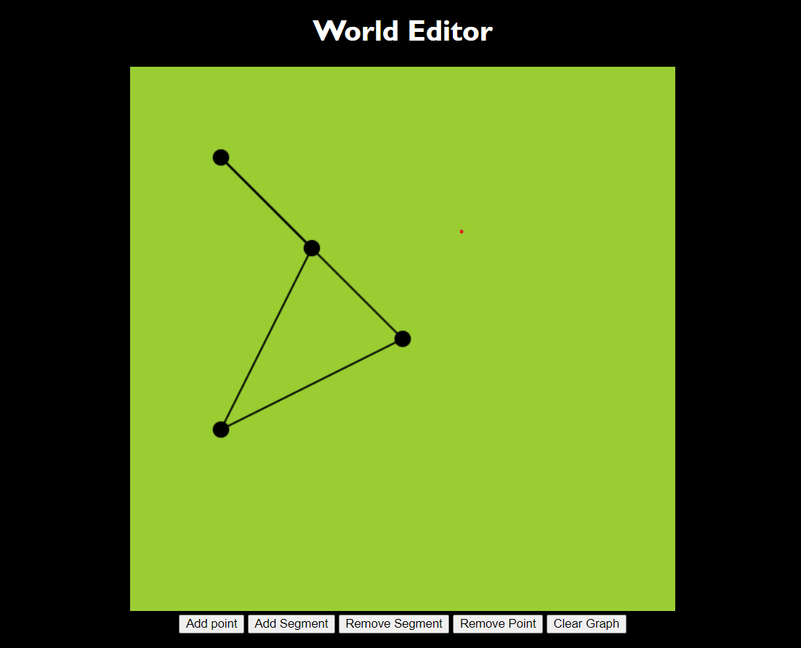

## Repository for learning neural network using JS and a fun project

Video Referred : https://www.youtube.com/watch?v=5iHejdqYIa8&t=3410s

#### Program-1 
Graph and representation of them thorugh 2d Canvas  

#### Program-2 